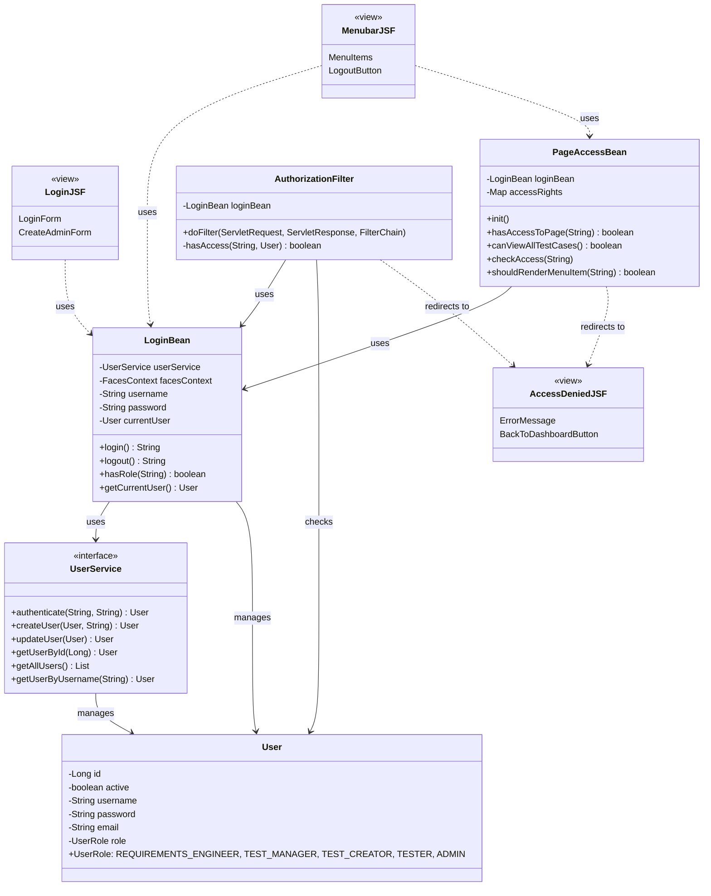

```mermaid

classDiagram
class LoginJSF {
<<view>>
LoginForm
CreateAdminForm
}

    class MenubarJSF {
        <<view>>
        MenuItems
        LogoutButton
    }

    class AccessDeniedJSF {
        <<view>>
        ErrorMessage
        BackToDashboardButton
    }

    class LoginBean {
        -UserService userService
        -FacesContext facesContext
        -String username
        -String password
        -User currentUser
        +login() String
        +logout() String
        +hasRole(String) boolean
        +getCurrentUser() User
    }

    class PageAccessBean {
        -LoginBean loginBean
        -Map<String, Object> accessRights
        +init()
        +hasAccessToPage(String) boolean
        +canViewAllTestCases() boolean
        +checkAccess(String)
        +shouldRenderMenuItem(String) boolean
    }

    class AuthorizationFilter {
        -LoginBean loginBean
        +doFilter(ServletRequest, ServletResponse, FilterChain)
        -hasAccess(String, User) boolean
    }

    class UserService {
        <<interface>>
        +authenticate(String, String) User
        +createUser(User, String) User
        +updateUser(User) User
        +getUserById(Long) User
        +getAllUsers() List<User>
        +getUserByUsername(String) User
    }

    class User {
        -Long id
        -boolean active
        -String username
        -String password
        -String email
        -UserRole role
        +UserRole: REQUIREMENTS_ENGINEER, TEST_MANAGER, TEST_CREATOR, TESTER, ADMIN
    }

    LoginJSF ..> LoginBean : uses
    MenubarJSF ..> LoginBean : uses
    MenubarJSF ..> PageAccessBean : uses
    LoginBean --> UserService : uses
    LoginBean --> User : manages
    PageAccessBean --> LoginBean : uses
    AuthorizationFilter --> LoginBean : uses
    AuthorizationFilter --> User : checks
    UserService --> User : manages
    AuthorizationFilter ..> AccessDeniedJSF : redirects to
    PageAccessBean ..> AccessDeniedJSF : redirects to
```
