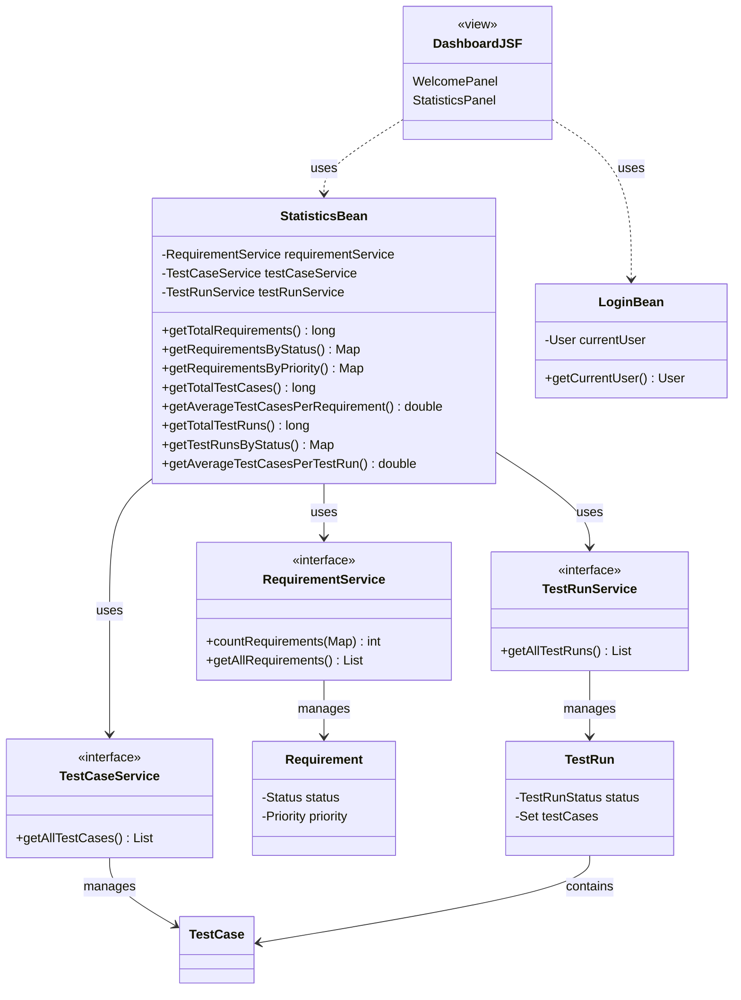

```mermaid

classDiagram
    class DashboardJSF {
        <<view>>
        WelcomePanel
        StatisticsPanel
    }

    class StatisticsBean {
        -RequirementService requirementService
        -TestCaseService testCaseService
        -TestRunService testRunService
        +getTotalRequirements() long
        +getRequirementsByStatus() Map<Requirement.Status, Long>
        +getRequirementsByPriority() Map<Requirement.Priority, Long>
        +getTotalTestCases() long
        +getAverageTestCasesPerRequirement() double
        +getTotalTestRuns() long
        +getTestRunsByStatus() Map<TestRun.TestRunStatus, Long>
        +getAverageTestCasesPerTestRun() double
    }

    class RequirementService {
        <<interface>>
        +countRequirements(Map<String, FilterMeta>) int
        +getAllRequirements() List<Requirement>
    }

    class TestCaseService {
        <<interface>>
        +getAllTestCases() List<TestCase>
    }

    class TestRunService {
        <<interface>>
        +getAllTestRuns() List<TestRun>
    }

    class Requirement {
        -Status status
        -Priority priority
    }

    class TestCase {
    }

    class TestRun {
        -TestRunStatus status
        -Set<TestCase> testCases
    }

    class LoginBean {
        -User currentUser
        +getCurrentUser() User
    }

    DashboardJSF ..> StatisticsBean : uses
    DashboardJSF ..> LoginBean : uses
    StatisticsBean --> RequirementService : uses
    StatisticsBean --> TestCaseService : uses
    StatisticsBean --> TestRunService : uses
    RequirementService --> Requirement : manages
    TestCaseService --> TestCase : manages
    TestRunService --> TestRun : manages
    TestRun --> TestCase : contains

```
