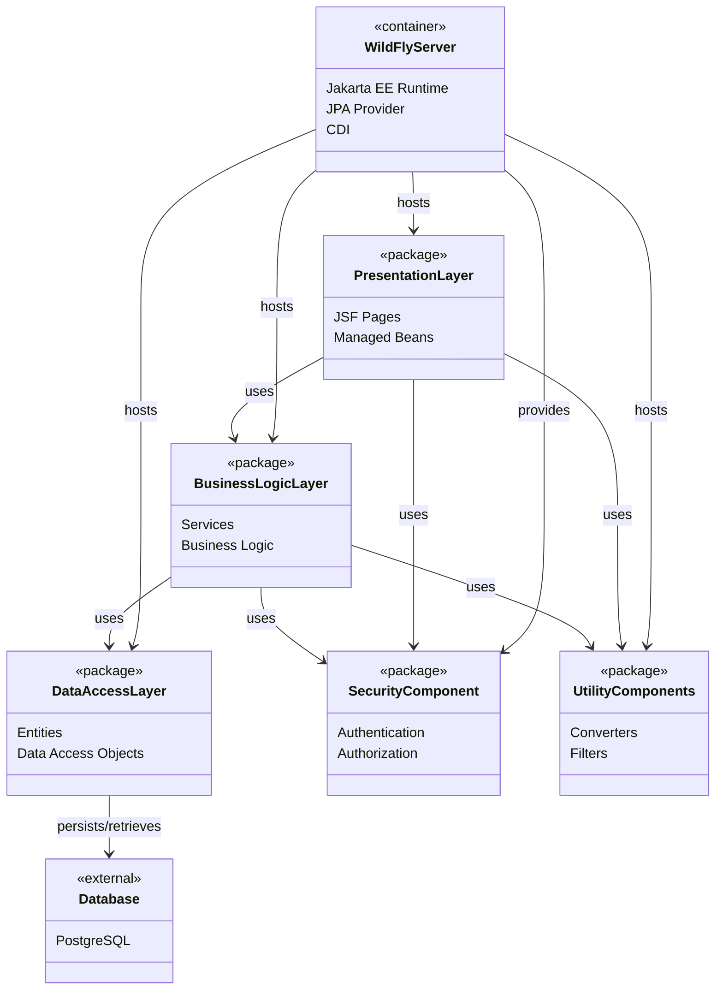

```mermaid

classDiagram
    class WildFlyServer {
        <<container>>
        Jakarta EE Runtime
        JPA Provider
        CDI
    }
    class PresentationLayer {
        <<package>>
        JSF Pages
        Managed Beans
    }
    class BusinessLogicLayer {
        <<package>>
        Services
        Business Logic
    }
    class DataAccessLayer {
        <<package>>
        Entities
        Data Access Objects
    }
    class SecurityComponent {
        <<package>>
        Authentication
        Authorization
    }
    class UtilityComponents {
        <<package>>
        Converters
        Filters
    }
    class Database {
        <<external>>
        PostgreSQL
    }

    WildFlyServer --> PresentationLayer : hosts
    WildFlyServer --> BusinessLogicLayer : hosts
    WildFlyServer --> DataAccessLayer : hosts
    WildFlyServer --> SecurityComponent : provides
    WildFlyServer --> UtilityComponents : hosts
    PresentationLayer --> BusinessLogicLayer : uses
    PresentationLayer --> SecurityComponent : uses
    BusinessLogicLayer --> DataAccessLayer : uses
    BusinessLogicLayer --> SecurityComponent : uses
    DataAccessLayer --> Database : persists/retrieves
    PresentationLayer --> UtilityComponents : uses
    BusinessLogicLayer --> UtilityComponents : uses

```