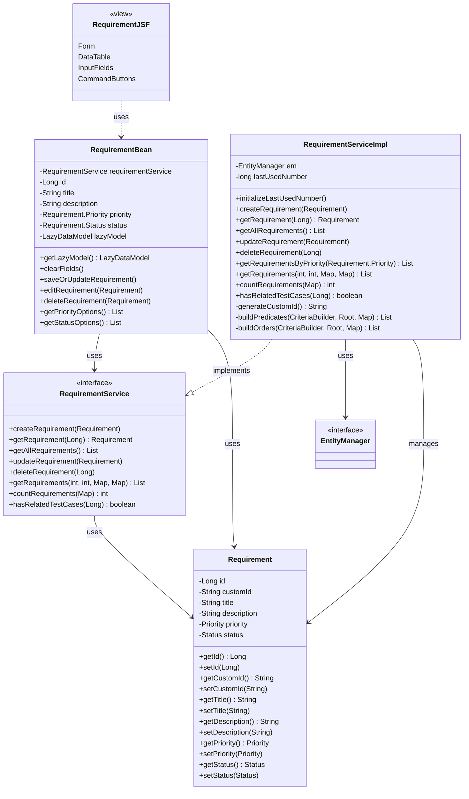

```mermaid
classDiagram
    class RequirementBean {
        -RequirementService requirementService
        -Long id
        -String title
        -String description
        -Requirement.Priority priority
        -Requirement.Status status
        -LazyDataModel<Requirement> lazyModel
        +getLazyModel() LazyDataModel<Requirement>
        +clearFields()
        +saveOrUpdateRequirement()
        +editRequirement(Requirement)
        +deleteRequirement(Requirement)
        +getPriorityOptions() List<SelectItem>
        +getStatusOptions() List<SelectItem>
    }

    class RequirementService {
        <<interface>>
        +createRequirement(Requirement)
        +getRequirement(Long) Requirement
        +getAllRequirements() List<Requirement>
        +updateRequirement(Requirement)
        +deleteRequirement(Long)
        +getRequirements(int, int, Map<String, SortMeta>, Map<String, FilterMeta>) List<Requirement>
        +countRequirements(Map<String, FilterMeta>) int
        +hasRelatedTestCases(Long) boolean
    }

    class RequirementServiceImpl {
        -EntityManager em
        -long lastUsedNumber
        +initializeLastUsedNumber()
        +createRequirement(Requirement)
        +getRequirement(Long) Requirement
        +getAllRequirements() List<Requirement>
        +updateRequirement(Requirement)
        +deleteRequirement(Long)
        +getRequirementsByPriority(Requirement.Priority) List<Requirement>
        +getRequirements(int, int, Map<String, SortMeta>, Map<String, FilterMeta>) List<Requirement>
        +countRequirements(Map<String, FilterMeta>) int
        +hasRelatedTestCases(Long) boolean
        -generateCustomId() String
        -buildPredicates(CriteriaBuilder, Root<Requirement>, Map<String, FilterMeta>) List<Predicate>
        -buildOrders(CriteriaBuilder, Root<Requirement>, Map<String, SortMeta>) List<Order>
    }

    class Requirement {
        -Long id
        -String customId
        -String title
        -String description
        -Priority priority
        -Status status
        +getId() Long
        +setId(Long)
        +getCustomId() String
        +setCustomId(String)
        +getTitle() String
        +setTitle(String)
        +getDescription() String
        +setDescription(String)
        +getPriority() Priority
        +setPriority(Priority)
        +getStatus() Status
        +setStatus(Status)
    }

    class EntityManager {
        <<interface>>
    }

    class RequirementJSF {
        <<view>>
        Form
        DataTable
        InputFields
        CommandButtons
    }

    RequirementJSF ..> RequirementBean : uses
    RequirementBean --> RequirementService : uses
    RequirementServiceImpl ..|> RequirementService : implements
    RequirementServiceImpl --> EntityManager : uses
    RequirementServiceImpl --> Requirement : manages
    RequirementBean --> Requirement : uses
    RequirementService --> Requirement : uses

```