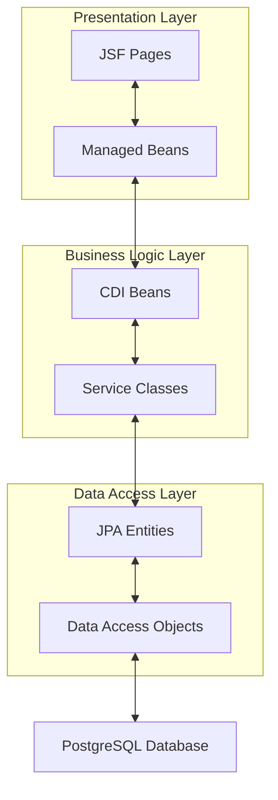

# Require4Testing

Require4Testing is a web application for organizing manual application tests, developed for a small startup in the web development sector.

## Key Features

- Creation and management of testable requirements
- Setting up and managing test runs
- Creation of test cases for specific requirements
- Assignment of test cases and testers to test runs
- Recording of test results by testers

## Technical Stack

- Jakarta EE 10
- PrimeFaces for the user interface
- CDI (Contexts and Dependency Injection)
- JPA (Java Persistence API) for database access
- WildFly as application server
- PostgreSQL as database system

## Project Structure

The application follows a three-tier architecture:

## Security Measures

- Implementation of input validation
- Authentication and authorization for different user roles

## License
This project is licensed under the MIT License - see the LICENSE.md file for details.